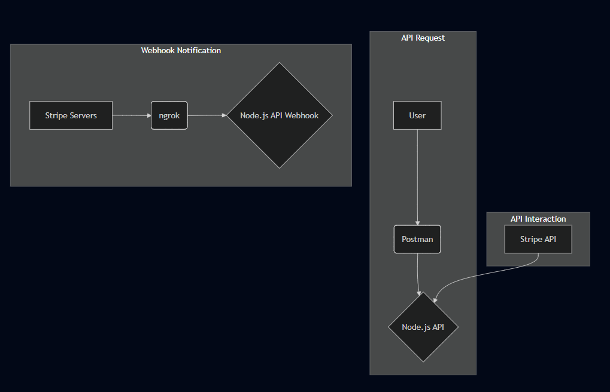

# Project: SaaS Subscription Backend with Node.js & Stripe

### FINAL PROJECT VERSION: V1 - OCT 19, 2025

This repository contains the backend source code for a SaaS (Software as a Service) application built with Node.js, Express.js, and MongoDB. The project demonstrates a complete backend system for managing user accounts, authentication, and subscription payments through a third-party API, Stripe.

The application features a secure REST API with JWT-based authentication and a full, test-mode integration with Stripe for creating subscription checkout sessions and handling payment confirmation via webhooks. The entire system is designed to be a robust foundation for any subscription-based service.

## Core Concepts & Skills Demonstrated

### **Backend API Development (Node.js Stack)**:

- Built a scalable and well-structured **REST API** using **Node.js** and the **Express.js** framework.
- Demonstrated proficiency in a **non-relational database (MongoDB)** by defining schemas and managing data with the **Mongoose ODM**.

### **Third-Party API Integration (Stripe)**:
- Successfully integrated the official Stripe **Node.js SDK** to handle core payment logic.

- Implemented the creation of **Stripe Checkout Sessions**, providing a secure, off-site URL for users to enter payment details.

### **Webhook Handling & Asynchronous Events**:

- Created a dedicated **webhook endpoint** to receive and process **asynchronous notifications** from Stripe's servers.

- Local testing of webhooks, a critical and complex development task by using **ngrok** to create a secure tunnel from the public internet to the local development server.

### **Authentication & Security**:

- Implemented a full user registration and login system with secure **password hashing** using **bcrypt.js**.

- Designed and built a **custom authentication middleware** to protect specific API routes, ensuring they are only accessible by users with a valid **JWT (JSON Web Token)**.

### **Modern Development Tooling**:

- Utilized **Postman** for comprehensive **API testing**, including requests with custom bodies and authorization headers.

- Managed project dependencies and scripts using **NPM**.
- Configured a smooth development workflow with **nodemon** for automatic server restarts.


## Architecture Diagram


_(Flow: User -> Postman -> Node.js API. Then, a separate flow: Node.js API <-> Stripe API. And a third flow: Stripe Servers -> ngrok -> Node.js API Webhook.)_


## How to Run This Project Locally

### Prerequisites:

- Node.js and npm (LTS version recommended).
- Docker Desktop installed and running.
- A free Stripe developer account and your API secret key.

### Step 1: Clone the Repository & Install Dependencies

```bash
git clone https://github.com/YogeshT22/saas-subscription-app.git
cd saas-subscription-app
npm install
```

### Step 2: Configure Environment Variables

- Create a .env file in the project root by copying the example:
	```bash
	cp .env.example .env
	```
- Open the .env file and fill in your unique values:

	- JWT_SECRET: A long, random string for signing your tokens.
	- STRIPE_SECRET_KEY: Your Stripe secret key (starts with sk_test_...).
	
### Step 3: Launch the MongoDB Database

- This command will start a MongoDB container in the background.

	```bash
	docker-compose up -d
	```
	
### Step 4: Start the Node.js Server

- This command starts the application server using nodemon, which will automatically restart on file changes.

	```Bash
	npm run dev
	```
_The server will be running at `http://localhost:8000.`_

## API Usage & End-to-End Testing Flow

- The API is now running. Use an API client like **Postman** to test the full subscription workflow.

### Step 1: Register and Log In

- **Register**: Send a POST request to `http://localhost:8000/api/users/register` with a JSON body:

	```JSON
	{ "email": "test@example.com", "password": "password123" }
	```

- **Log In**: Send a POST request to `http://localhost:8000/api/users/login` with the same credentials to receive a JWT access_token.

### Step 2: Create a Stripe Checkout Session

- **Prerequisite**: Create a product with a price in your Stripe dashboard (in Test Mode) and copy its Price ID (e.g., price_1P...).

- **Authorize**: In Postman, create a new request. In the "Authorization" tab, set the type to "Bearer Token" and paste the token from the login step.

- **Send Request**: Send a POST request to `http://localhost:8000/api/subscriptions/create-checkout-session` with a JSON body containing your Price ID:
	```JSON
	{ "priceId": "price_1P..." }
	```

- **Result**: The API will respond with a url. Pasting this into a 
browser redirects you to a mock Stripe payment page.

### Step 3: Test the Stripe Webhook Locally with ngrok

- To test the final piece—Stripe confirming the payment back to our server—we need to temporarily expose our local server to the internet.

- **Install ngrok**: Download and install the ngrok client.
- **Start the Tunnel**: In a new terminal, run the following command. 

	_This creates a public URL that forwards traffic to your local server._
	
	```Bash
	ngrok http 8000
	```
_Copy the public URL provided by ngrok (it will look like `https://<random-string>.ngrok-free.app`.)_

- **Configure Stripe**: In your Stripe dashboard, go to Developers > Webhooks and add a new endpoint.

- **Endpoint URL**: Paste your ngrok URL and add the **webhook path**: `https://<random-string>.ngrok-free.app/api/subscriptions/webhook`

- **Events to send**: Select checkout.session.completed.

- **Complete the Payment**: Go back to the Stripe checkout URL you generated in Step 2. Use Stripe's test card numbers (e.g., 4242...) to complete the "payment".

- **Verify**: After payment, check the terminal where your Node.js server is running. You will see a log message confirming that the user's subscription status has been updated. This confirms the end-to-end flow is working successfully.


## License
This project is licensed under the MIT License - see the LICENSE file for details.